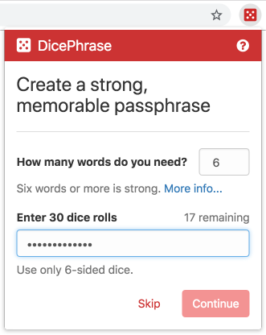
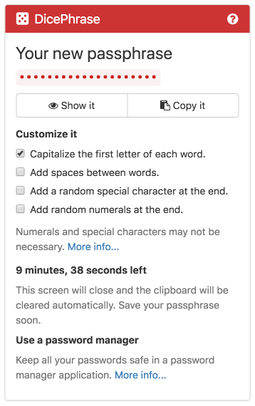

# DicePhrase

A tool for making strong, memorable passphrases.

[Install in Firefox](https://addons.mozilla.org/en-US/firefox/addon/dicephrase/)

[Install in Google Chrome](https://chrome.google.com/webstore/detail/dicephrase/hlcidibhelknhpnimiiogjclajfopdag)

## About DicePhrase

DicePhrase is a browser extension that helps you easily create strong, memorable passphrases, such as `FragrantRenewedAnyoneBakedPossum` or `BazookaClangUnstuckTransferQuoteJokingly`, by rolling six-sided dice to randomly select from a set of thousands of words. This system creates passphrases that are more unguessable than if you were to pick words on your own or trust the computer to generate words automatically.

It's based on best practice strategies for creating passphrases by the [Electronic Frontier Foundation](https://www.eff.org/dice), security technologist [Micah Lee](https://firstlook.org/theintercept/2015/03/26/passphrases-can-memorize-attackers-cant-guess/), and the [Diceware](http://world.std.com/~reinhold/diceware.html) project.

## Passphrases, not passwords
Long, random passphrases are more secure because they're more difficult for an attacker to guess than simple passwords. While a password like `Batman1989` is too easily guessed and `&1KJl6a8y$g*01W}i21!MZ` is too hard to remember, random passphrases like `DonutConfinedCurveHurricaneJuggleWidget` are strong and memorable.

Passphrases don't need to be personal to be memorable. Personal things like birthdays, addresses, anniversaries, names, lyrics, books, movies, etc. are not very secret; anyone can find out your address, pet's name, or favourite songs. Picking words randomly ensures your passphrase is unbiased and unpredictable.

## Roll the dice
You do five dice rolls to randomly select each word for your passphrase, so if you need a 6-word passphrase, that's 30 dice rolls. Input the numbers into DicePhrase, which will then use them to look up corresponding words in a table of 7776 possible words to generate your new passphrase. With each additional word, the chances that anyone could ever guess your passphrase become exponentially smaller.

## Why use dice?
Dice are a more reliable and transparent source of randomness than choosing numbers yourself or having a computer generate random numbers. Humans tend to have too much bias when attempting to make random selections, and it's hard to prove that the complex systems used by computers for creating randomness are truly unpredictable. If you don't need such a high level of unpredictability, DicePhrase can generate pseudo-random numbers without dice when you click "Skip" in the main window, although using dice is still recommended.

## When should I use passphrases?
Passphrases are ideal when used to encrypt information. They're perfect as the master password for a [password manager](doc/help.md#password-manager-applications) so you only need to remember a single strong passphrase. They're also great for securing WiFi networks, disk encryption, PGP or SSH encryption keys, and any other encryption system. Use them whenever you need memorable authentication in general.

For online accounts, having strong passphrases is good, but may not be enough protection from attackers who use techniques like [phishing](https://en.wikipedia.org/wiki/Phishing) to steal credentials. You should enable [Two-Factor Authentication](https://www.turnon2fa.com/), which adds a second step to the login process, and consider saving unique passphrases for each account in a password manager.

## Secure design
DicePhrase is built to protect the confidentiality of your passphrases. Most importantly, passphrases aren't saved, they're automatically cleared 10 minutes after they've been created (you should memorize them or save them in a password manager application). DicePhrase is also free and open source software, so anyone can [inspect the code](https://github.com/dicephrase/dicephrase) to verify its safety. You can [read more](doc/help.md#dicephrases-security-design) about DicePhrase's security design, as well as how to report bugs.

## Get support
DicePhrase includes built-in documentation about how to use it and to help you understand passphrase security. Access it by clicking the **?** icon in DicePhrase, or [view it online](doc/help.md).

If you need any additional support, please [get in touch](doc/help.md#get-support).

## Requirements
DicePhrase requires Google Chrome, Chrome OS, or Chromium, or Mozilla Firefox. Make sure you're running the latest version of your browser in order to have the best security protection.

At least one six-sided die is needed to create random passphrases. If you don't have any dice available, DicePhrase can generate pseudo-random numbers instead, although rolling dice is still recommended.

## Development
DicePhrase's documentation needs to be compiled using Jekyll and the Firefox extension needs to be packaged with web-ext. See the [build notes](BUILD.md) for more info.

Anyone is welcome to help build this program. Together, we can make it even better. You can help by:
- Reporting software bugs or suggesting new ideas on the [issue tracker](https://github.com/dicephrase/dicephrase/issues).
- Submitting code changes or fixes.
- Auditing the code and [reporting security issues](doc/help.md#reporting-security-vulnerabilities).
- Telling your friends about DicePhrase and/or sharing it with them.

By submitting code changes, you agree to licence your work under the [GNU General Public License](https://www.gnu.org/licenses/gpl.html), version 3 or later. By submitting documentation changes, you agree to licence your work under the [GNU Free Documentation License](https://www.gnu.org/licenses/fdl.html), version 1.3 or later.

## Licences
DicePhrase is copyright © 2020 [Lucas Bleackley Petter](https://www.lucaspetter.com).

DicePhrase is free software: you can redistribute it and/or modify it under the terms of the [GNU General Public License](https://www.gnu.org/licenses/gpl.html) as published by the Free Software Foundation, either version 3 of the License, or (at your option) any later version.

DicePhrase is distributed in the hope that it will be useful, but WITHOUT ANY WARRANTY; without even the implied warranty of MERCHANTABILITY or FITNESS FOR A PARTICULAR PURPOSE. See the GNU General Public License for more details.

Permission is also granted to copy, distribute and/or modify DicePhrase's documentation under the terms of the [GNU Free Documentation License](https://www.gnu.org/licenses/fdl.html), Version 1.3 or any later version published by the Free Software Foundation; with no Invariant Sections, no Front-Cover Texts, and no Back-Cover Texts. A copy of the license is included in the section entitled "GNU Free Documentation License".

The full text of both licences is bundled with DicePhrase [here](LICENSE.txt).

### Credit to third-party software used in DicePhrase
- [Bootstrap](https://getbootstrap.com/) is copyright © 2011-2016 Twitter, Inc., licenced under the [MIT License](https://github.com/twbs/bootstrap/blob/master/LICENSE).
- "external-link-ltr-icon.svg" is part of [MediaWiki](https://www.mediawiki.org/), copyright © 2016 MediaWiki collaborators, licenced under the [GNU GPL 2.0](https://www.mediawiki.org/wiki/Download) licence.
- [Font Awesome](http://fontawesome.io/) is copyright © 2016 Dave Gandy, licenced under the [MIT and SIL OFL 1.1 Licenses](http://fontawesome.io/license/).
- The [Long Wordlist](https://www.eff.org/dice) is copyright © 2016 Electronic Frontier Foundation, licenced under the [Creative Commons Attribution 3.0](https://www.eff.org/copyright) licence.
- [Modernizr](https://modernizr.com/) is copyright © 2016 Modernizr collaborators, licenced under the [MIT License](https://github.com/Modernizr/Modernizr/blob/master/readme.md).
- [OpenWireless](https://github.com/efforg/OpenWireless/) is copyright © 2014 Electronic Frontier Foundation and other contributors, licenced under the [Apache 2.0](https://github.com/EFForg/OpenWireless/blob/master/LICENSE) licence.
